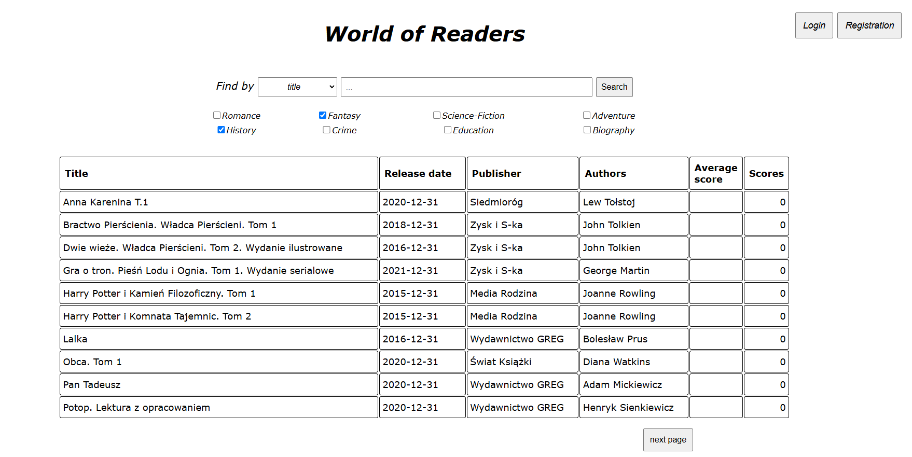
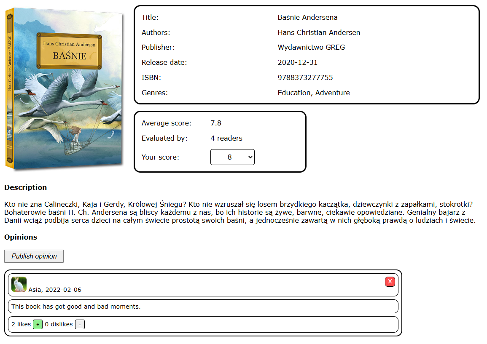
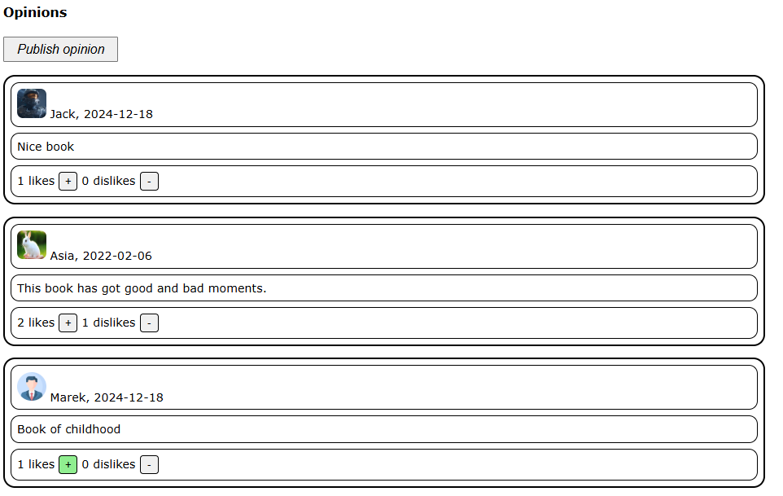
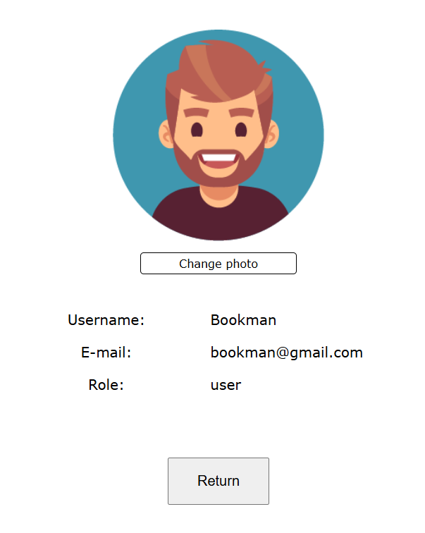
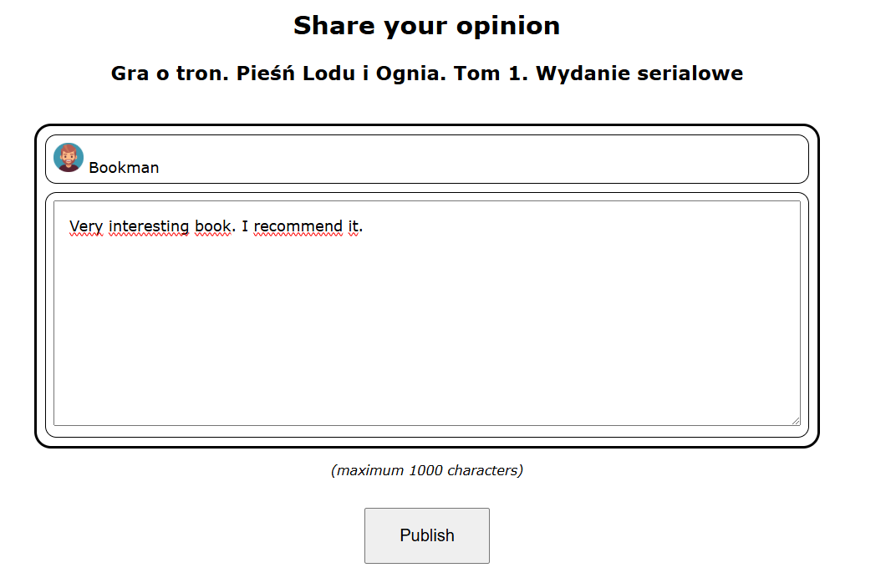
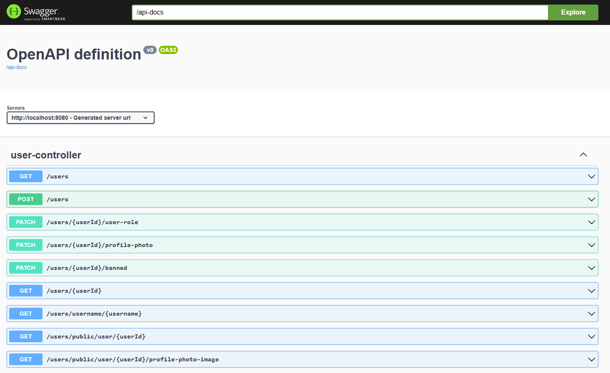

Welcome, dear viewer!

The application divides at two different parts.

The first one is server. Unfortunately it requires some environment preparations. I will do my best to explain you
every step you have to take in order to run it successfully.

1. Install Java Development Kid in version at least 17.
2. Install docker at your computer. It will be used for running PostgreSQL.
3. Install Intellij IDEA or other IDE, which will allow you to boot the application.

If your system environment is ready, you are able to set required parameters and execute commands.

1. Open with your IDE the "Server" folder.
2. Locate file with name "docker-compose.yml" and execute "docker-compose up".
3. Open file "application.properties" and set there correct paths to folders and files. Disc paths should be absolute.
4. Use gradle panel in IDE to run bootRun task or manually execute command "./gradlew bootRun".

Hopefully server is up and running.

The second part of the application is browser. Fortunately this part is a lot more friendly to start with.

1. Locate file "catalog.html" in folder "Browser/catalog".
2. Open it with Chrome or any other browser.
3. Enjoy using the World of Readers :)

Screenshots:

